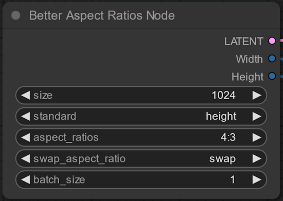

# comfyui_better_aspect_ratio
I made some minor changes to the already existing aspect ratio node from maassao000. -> [link](https://github.com/massao000/ComfyUI_aspect_ratios/tree/main

# Changes

The only truly notible changes are the adittion of 2 more return values.

- `width` and `height`

I also changed the positions of `aspect_ratios` and `standard`, as i found the initial order a bit unintuitive.

# Usage

As there are no actual changes in the way this node works or is set up, please refer to the original Documentation found [here](https://github.com/massao000/ComfyUI_aspect_ratios/blob/main/README.md#Usage).